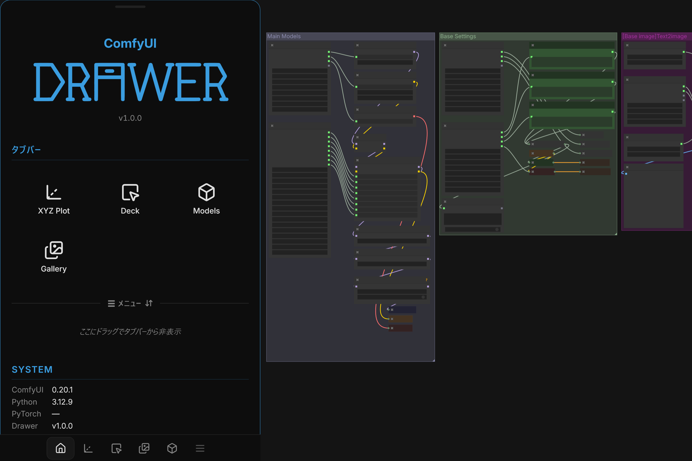
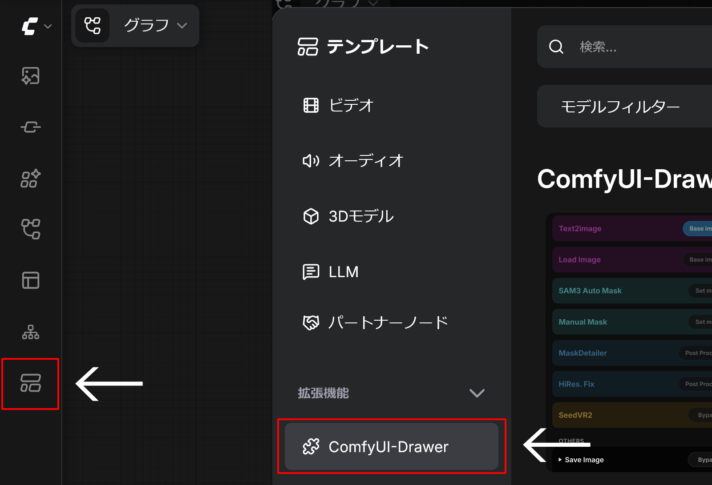
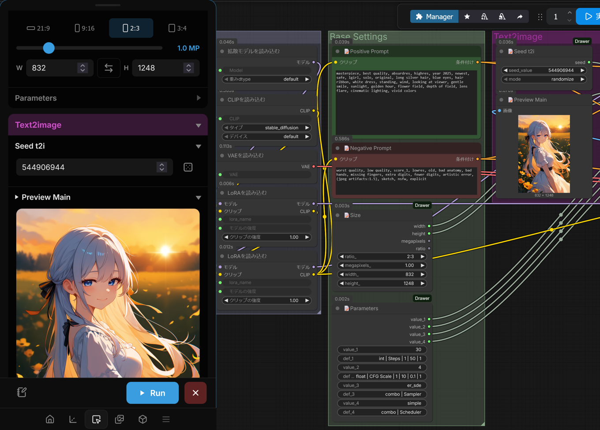
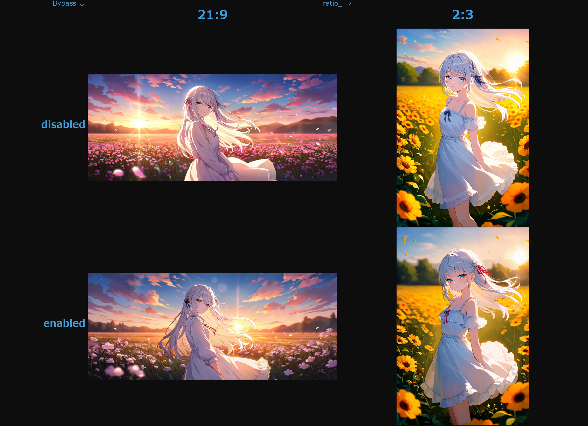
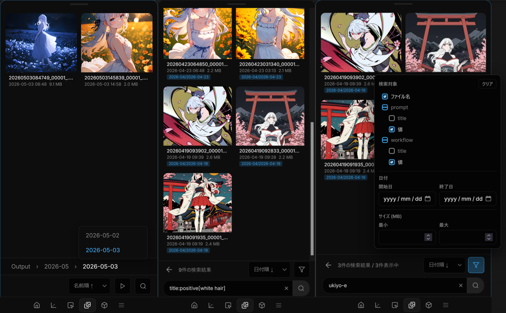
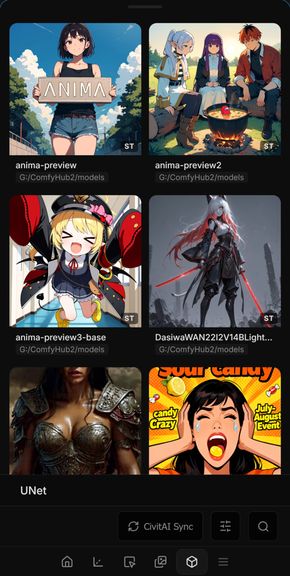
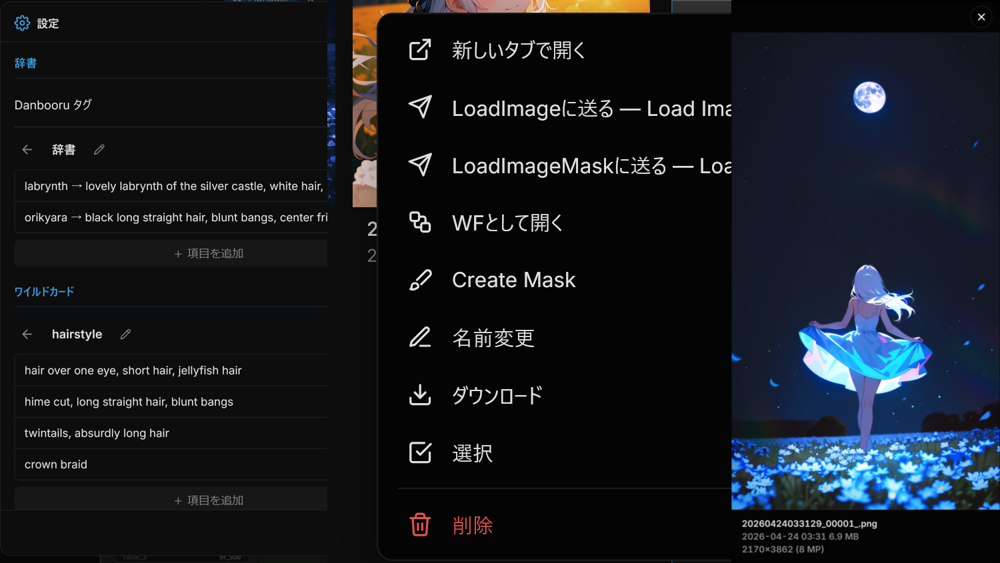

<p align="center">
  
</p>

<h3 align="center">适合移动端使用的 ComfyUI 模块化 UI 平台</h3>

<p align="center">
  <a href="#comfyui-drawer-是什么">概览</a> •
  <a href="#安装">安装</a> •
  <a href="#示例工作流">示例</a> •
  <a href="#内置小工具">小工具</a> •
  <a href="#其他功能">其他</a> •
  <a href="#drawer-节点">节点</a> •
  <a href="#开发者与-agent-说明">开发</a> •
  <a href="CHANGELOG.md">更新日志</a> •
  <a href="LICENSE">许可证</a>
</p>

<p align="center">
  <a href="README.md">English</a> •
  <a href="README_ja.md">日本語</a>
</p>

<p align="center">
  
  
  
</p>

---

## ComfyUI-Drawer 是什么

这是一个运行在 ComfyUI 上、适合移动端使用的 UI 平台，**100% 由 AI 编写代码**。
它以 **小工具（gadget）** 为单位组织功能，每个小工具都是相互独立的 UI 模块，便于扩展。

各个小工具会收纳在屏幕底部的标签栏中。无论在桌面端还是移动端，都无需离开当前工作流，就可以在同一个面板中完成参数操作、图片管理、模型管理和参数扫描等任务。

---

## 安装

### 通过 ComfyUI-Manager 安装（推荐）

在 [ComfyUI-Manager](https://github.com/ltdrdata/ComfyUI-Manager) 的安装菜单中搜索 **ComfyUI-Drawer**。

### 手动安装

```bash
cd ComfyUI/custom_nodes
git clone https://github.com/Kuroi961/ComfyUI-Drawer.git
pip install -r ComfyUI-Drawer/requirements.txt
```

---

## 示例工作流

<p align="left">
  
</p>

可以从 ComfyUI 的模板界面打开 ComfyUI-Drawer 的示例工作流。

- `drawer-sample-anima` — 展示 Drawer 基本用法的示例工作流
- `drawer-sample-anima-advanced` — 包含 SAM3、SeedVR2 的更实用工作流，需要额外模型和自定义节点
- `drawer-tutorial-deck-ja` / `drawer-tutorial-deck-en` / `drawer-tutorial-deck-zh` — 说明如何把节点显示到 Deck 中的教程

---

## 内置小工具

### Deck

<p align="left">
  
</p>

用于快速操作工作流参数的小工具。

**显示控制：**

在节点或分组标题中添加**标记**，即可控制 Deck 中显示的内容。

| 标记 | 对象 | 效果 |
|------|------|------|
| `📝` | 节点标题 | 将该节点的 widget 显示在 Deck 主界面 |
| `⚡` | 节点或分组标题 | 添加 bypass 的 ON/OFF 开关 |
| `[标签]` | 节点或分组标题 | 在相同标签之间创建互斥 bypass 开关 |

节点按 Y 轴从上到下排序，分组按 X 轴从左到右排序。

**其他行为：**

- 只要分组中包含至少一个可显示节点，就会作为 section 显示
- 不属于任何分组的节点会汇总到末尾的 Other 中
- 左下角按钮可以显示不含 `📝` 的节点

---

### XYZ Plot

<p align="left">
  
</p>

类似 Stable Diffusion web UI（A1111）的参数扫描小工具，整体行为大致遵循 A1111。

**基本功能：**

- 可将任意节点的任意 widget 指定为 X/Y/Z 轴并连续生成
- 文本 widget 会自动使用 Prompt S/R（Search & Replace）模式
- Bypass 轴 — 可将节点自身的 ON/OFF 状态作为扫描维度
- 自动生成带轴标签的合成网格图，并保存到 output

**技术细节：**

| 项目 | 说明 |
|------|------|
| **队列锁定** | 扫描期间会 monkey-patch `app.queuePrompt`，阻止外部队列提交；扫描结束后恢复 |
| **种子固定** | 扫描开始时保存所有 widget 的快照。每次迭代前先恢复快照，再叠加轴上的值 |
| **DrawerSeed 联动** | 扫描前只随机化一次。扫描期间通过 `window.__xyzSweepActive` 抑制 DrawerSeed 的 queue hook 随机化 |
| **batch_size 强制** | 非扫描目标的 `batch_size` widget 会强制为 `1`，`control_after_generate` 会强制为 `fixed` |
| **预检查** | 扫描前验证 widget 类型和值范围；不匹配时显示警告 |
| **服务器断开检测** | 监听 WebSocket 的 `status` / `reconnecting` 事件，服务器断开时立即中止扫描 |
| **工作流嵌入** | 将工作流 JSON 作为 PNG PngInfo 或 JPEG/WebP EXIF 嵌入合成图 |

---

### Gallery

<p align="left">
  
</p>

用于浏览 output、input、temp 目录下媒体和文件夹的小工具。

- 文件夹导航（面包屑）、按名称/日期/大小排序
- 文件重命名、移动（D&D / 批量选择）和删除
- 首次启动时自动生成基于 SQLite 的搜索索引，可按节点类型、节点标题、输入值等工作流元数据全文搜索
- 新建文件夹、移动文件夹、删除文件夹

---

### Model Viewer

<p align="left">
  
</p>

用于浏览 ComfyUI 的 models 目录，以及通过 `extra_model_paths.yaml` 添加的模型路径。

- 支持所有模型类型，例如 checkpoints、loras、vae、embeddings、controlnet、upscale_models 等
- **CivitAI 同步** — 通过 SHA256 哈希匹配获取元数据和预览图，并支持 `.red` / `.com` fallback
- **节点匹配** — 可从信息卡把模型应用到当前工作流中的兼容 loader 节点；会扫描全部节点，包括子图、Combo Clone widget 和已连接的 DrawerControls
- **触发词** — 自动显示 CivitAI 的 `trainedWords`，LoRA 模型还可以添加自定义触发词
- 支持 sidecar 缩略图，可从 output 图片选择或删除
- 在网格和信息卡中支持视频预览（`.mp4` / `.webm`）
- 每个模型的用户备忘会保存到 `.drawer.json`

---

## 其他功能

<p align="left">
  
</p>

### 用户词典与通配符

内置用于 prompt 自动补全的词典服务。

- **Danbooru 标签词典** — 带使用频率的标签数据库（CSV）
- **用户词典** — 可创建自定义的 tag → 插入文本映射
- **通配符** — 使用 `__名称__` 语法，从列表中随机选择一行
- **CSV / TXT 导入** — 可导入现有标签文件
- **注释语法** — 使用 `//`、`#`、`/* */` 注释 prompt 的一部分

可在设置面板中创建、编辑、启用或禁用词典。这些处理不需要专用节点，而是在 ComfyUI 入队时自动应用到整个工作流的文本输入。也就是说，普通 prompt 节点、通过 DrawerControls 传入的文本，以及其他字符串 widget，都可以在没有预处理节点的情况下使用注释移除和通配符展开。

**Prompt 处理规则：**

- `__名称__` 会从同名且已启用的通配符词典中选择一行并展开
- 展开基于工作流中的 `seed` / `noise_seed` / `seed_value`。找到种子时，相同种子会得到相同展开；找不到种子时使用普通随机选择
- 注释会从实际执行的 prompt 中移除，但会保留在输出图片所嵌入的工作流元数据中
- `/* ... */` 是块注释，`// ...` 是行注释，行首的 `# ...` 也作为行注释处理
- `\#`、`\/` 等转义标记会作为普通字符处理，不会开始注释

**CSV / TXT 导入格式：**

用户词典使用 CSV 导入，通配符使用 TXT 导入。CSV 需要第一行 header。

```csv
tag,insert_text
sky,"blue sky, clouds"
masterpiece,"masterpiece, best quality"
```

- `tag` 是自动补全中显示的名称
- `insert_text` 是选择后实际插入的文本。为空时使用 `tag` 本身
- 包含逗号的值需要像普通 CSV 一样用双引号包围

通配符 TXT 每行一个候选项。导入文件名，或在设置中修改后的词典名，会成为 `__名称__` 中使用的名称。

```txt
blue sky, sunlight
night city, neon lights
soft backlight, floating particles
```

- 空行会被忽略
- 以 `#` 或 `//` 开头的行不会作为通配符候选项使用
- 不进行递归通配符展开。如果候选项中包含 `__其他名称__`，该字符串会原样保留
- 注释中的通配符不会被展开

### 上下文菜单

右键/长按即可打开菜单。支持在新标签页打开、发送到 LoadImage / LoadImageMask、作为工作流打开、下载等操作。每个小工具也可以注册自己的菜单项。

### Lightbox

支持图片、视频、音频的全屏媒体查看器。可从 Gallery、Deck、XYZ Plot 和通用媒体卡片打开。

- 键盘（←→ / A/D）、滑动、按钮前后导航
- 点击当前图片，或使用上下文菜单，可在新标签页打开媒体
- 可从 Lightbox 将图片拖拽到 ComfyUI 画布
- Lightbox 内也支持上下文菜单

### 弹窗与对话框

提供 `showAlert`、`showConfirm`、`showPrompt`、`showDialog` 四种接口。

### 文件选择器

用于选择媒体文件的模态选择器。支持图片、视频、音频选择，并内置带缩略图的文件夹导航。

### 蒙版编辑器

可从图片上下文菜单打开的全屏简易蒙版编辑 UI。生成的蒙版会保存到 `input/drawer_masks`，并可直接应用到 `LoadImageMask` 节点。

### 多语言支持

支持英语、日语、简体中文。语言会跟随 ComfyUI 的 Settings > Locale 自动切换。

---

## Drawer 节点

内置 9 个实用节点，其中一部分在 Deck 上有专用 UI。

| 节点 | 说明 |
|------|------|
| **DrawerSeed** | 带 randomize / fixed 模式的种子节点 |
| **DrawerControls1 / 4 / 8 / 12** | 紧凑参数中枢。只有已连接的输出会在 Deck 上显示为 `int` / `float` / `combo` / `bool` / `string` 控件。单行文本使用 `string \| 标签`，多行文本使用 `string \| 标签 \| multiline`。combo 候选项会从连接目标 widget 读取 |
| **DrawerConcat** | 将可变数量的文本输入用指定分隔符连接 |
| **DrawerSize** | 从横向、纵向、正方形等分辨率预设输出 width/height |
| **DrawerSwitch** | 任意数据类型的 A/B 开关。B 已连接且非空时返回 B，否则返回 A。使用 ComfyUI V3 API 的延迟求值，因此不需要的一侧不会执行 |
| **DrawerSwitchChain** | 可变长度 fallback 链。越靠后的已连接非空值优先 |

---

## 开发者与 Agent 说明

ComfyUI-Drawer 被设计为可扩展平台。你可以创建**单文件小工具**：

1. 复制 [docs/gadget-template.js](docs/gadget-template.js)
2. 放到任意 `custom_nodes/*/web/js/` 文件夹中，不一定要放在 ComfyUI-Drawer 内部
3. 修改类并重启 ComfyUI

```js
import { app } from "../../../scripts/app.js";

app.registerExtension({
    name: "Comfy.Drawer.MyGadget",
    async setup() {
        const drawer = window.ComfyDrawer ?? await new Promise(resolve =>
            window.addEventListener('comfy-drawer:ready', e => resolve(e.detail), { once: true })
        );
        const { GadgetBase } = drawer;

        class MyGadget extends GadgetBase {
            constructor() {
                super('my-gadget', { label: 'My Gadget', icon: '🔧', order: 10 });
            }
            onMount(container, bus, bridge) {
                container.innerHTML = '<p>Hello World</p>';
            }
        }

        drawer.registerGadget(new MyGadget());
    },
});
```

- 可通过 `window.ComfyDrawer` 使用 `GadgetBase`、`bus`、`bridge`、`settings`、`dict` 等服务
- CSS 可通过 `<style>` 标签注入，推荐使用 `@layer gadget-<id>` 限定作用域
- 唯一需要的外部 import 是 `app.js`，不需要依赖 Drawer 内部模块

完整 API 参考请参阅 [GADGET_API.md](GADGET_API.md)。

| 文档 | 说明 |
|------|------|
| [ARCHITECTURE.md](ARCHITECTURE.md) | 平台架构、模块职责、设计决策 |
| [CONVENTIONS.md](CONVENTIONS.md) | 代码风格、CSS 作用域、命名约定 |
| [GADGET_API.md](GADGET_API.md) | 小工具开发 API 参考 |

---

## 许可证

[MIT License](LICENSE) © 2026 Kuroi
